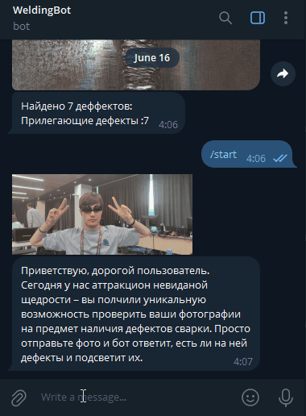

# Welding Quality Tester
by [PerdoTeam [MIDIFrogs]](https://github.com/MIDIFrogs)

## Features
- ✅ Simple to setup and use
- 🧩 Extensible
- 🌬️ lightweight

### Prerequisites:
- Installed Python v3.10+
- [Ultralytics](https://github.com/ultralytics/ultralytics) library (can be downloaded from requirements)

## Getting started
1. Open the terminal in repo directory
2. Run `pip install -r requirements.txt`

### CSV dataset processing
3. Run `python csvRunner.py`
4. Input path to the dataset directory
5. After processing you'll get `submission.csv` file with all the processing results.

### Telegram bot host (recommended for skilled users)
3. Setup your Telegram bot and get the token
4. Add your bot token to the `startup.config` file by key `Token`
5. Run `python weldingBot.py`
6. Feel free to use your bot!

## Need help?
Write me in [Telegram](https://t.me/ioexcept10n) or open an [issue](https://github.com/MIDIFrogs/WeldingQualityTester/issues/new/choose). Feel free to ask any questions!
